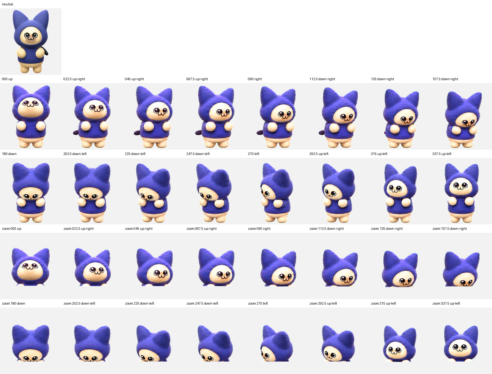

# 呆猫（Daimao）Codex Pet

一只软乎乎、略显呆萌的蓝紫色猫咪桌面伙伴。本仓库提供可直接安装的 Codex v2 宠物包及最终 QA 证据。



## 安装

```bash
mkdir -p ~/.codex/pets/daimao
cp pet.json spritesheet.webp ~/.codex/pets/daimao/
```

## 图集规格

- `spriteVersionNumber`: `2`
- 图集：`1536 × 2288`，RGBA WebP
- 网格：`8 × 11`
- 单元格：`192 × 208`
- 标准动画：9 行
- 观察方向：16 个，以 22.5° 顺时针递增
- SHA-256：`e6275464943f5b8f0dceda6b53dd0c8567ed51ecc7d28d5aa43b01ef2ecb5233`

## 目录

- `pet.json`：宠物元数据
- `spritesheet.webp`：可直接安装的 v2 精灵图
- `previews/`：9 个标准动画预览
- `qa/`：联系表、方向语义、盲测、连续性和最终验证结果

## QA 状态

- 9 行标准动画通过
- 16 个观察方向及三人盲测通过
- 去绿边、透明通道和 v2 图集结构验证通过
- 无透明像素 RGB 残留

制作流程在验收并打包后会清理临时生成条带、提示词和分帧中间文件；本仓库保留的是可安装成品与可复核的最终 QA 产物。

